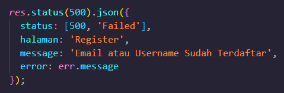

# # FINAL PROJECT | RAKAMIN ACADEMY | FSWD-5B

## Kelompok 1

- Raie Aswajjillah
- Affan Maulana Zulkarnain
- Muhammad Ikhsan Supriadi
- Iffat Nabil Wiridana
- Holid Muhamad Salman
- Hadiyantrama Oscar Santoso

```bash
npm install
```
Setelah melakukan `npm install` , lakukan setup file config.json untuk mengatur username & password dari databasemu.

# Di Mohon jangan PUSH Langsung ke Branch "master"

## Cara Branching

- Jika kamu bermaksud untuk meng-_improve_ atau memperbaharui

  > `git checkout -b "improvement/apa-yang-di-improve`

- Jika kamu bermaksud untuk _Bug Fixing_

  > `git checkout -b "bugfix/apa-yang-di-fix`

- Jika kamu bermaksud untuk menambah _Feature_

  > `git checkout -b "feature/fitur-apa-yang-di-buat`

## Cara Commit

- Jika kamu bermaksud untuk meng-_improve_ atau memperbaharui

  > `git commit -m "improvement: apa yang di improve`

- Jika kamu bermaksud untuk _Bug Fixing_

  > `git commit -m "bugfix: apa yang di fix`

- Jika kamu bermaksud untuk menambah _Feature_

  > `git commit -m "feature: fitur apa yang di buat`

## Setup .env
Jika ingin melakukan `npm run start` ubah `NODE_ENV` pada file .env menjadi `NODE_ENV=development`. Jika `NODE_ENV=test` maka proses listening dari server tidak akan berjalan.

## Step Setup Database Utama*
```bash
npx sequelize-cli db:create
```
```bash
npx sequelize-cli db:migrate
```
```bash
npx sequelize-cli db:seed:all
```
Lakukan ``npx sequelize-cli db:migrate:undo`` jika ingin menghapus table.

## Endpoint Return
response harus wajib berisi : 
- status: `Success / Failed`
- halaman: `Nama-halaman`
- message: `Pesan Keterangan`

jika ada data lain misal data yang ingin ditampilan sertakan diakhir. misalnya seperti data atau error pada 2 gambar dibawah.



